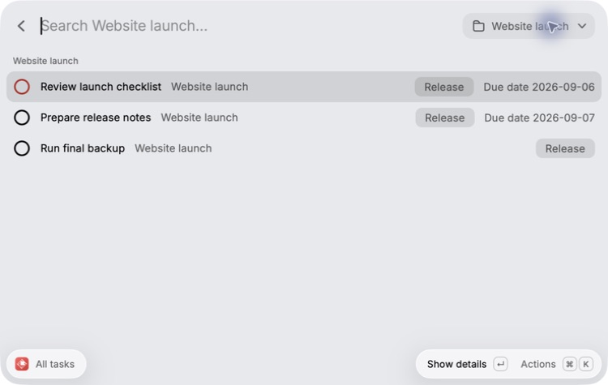

# Worktodo

Worktodo is a local-first personal task manager for Raycast. It stores tasks in a local SQLite database and provides an optional local MCP server for agent access.



## Features

- All tasks, Today, This week, Project, Label, Completed, and Trash views
- Notes, priority, due dates, Projects, and Labels
- Quick add and a menu-bar view for tasks due this week
- Versioned JSON export and validated full-dataset restore with an automatic recovery backup
- Optional MCP tools for reading and changing tasks through the same local database

## Requirements

- macOS with Raycast v2
- Node.js 24.18.0, as pinned in [`.nvmrc`](.nvmrc)
- Corepack with pnpm 11.24.0

## Install from source

```sh
git clone https://github.com/htjun/worktodo.git
cd worktodo
nvm use
corepack enable
corepack prepare pnpm@11.24.0 --activate
corepack pnpm install --frozen-lockfile
corepack pnpm run dev
```

Keep the development process running, then open `All tasks`, `Quick add`, `Backup & restore`, or `Worktodo menu bar` in Raycast.

## Update a source installation

```sh
git pull --ff-only
nvm use
corepack pnpm install --frozen-lockfile
corepack pnpm run dev
```

Stop the previous development process before restarting it. Source installations do not update automatically; pull, install, and restart to use new code.

## Optional MCP server

The MCP server is a separate local STDIO process. Build it and register its compiled entry point with a compatible client:

```sh
corepack pnpm run build:mcp
codex mcp add worktodo -- node /absolute/path/to/worktodo/dist/mcp/server.js
```

The server shares Worktodo's SQLite database. Its results can expose task titles, notes, due values, Project and Label associations, and lifecycle state to the configured client. Local database storage does not guarantee that the MCP client processes that content only on the local machine.

See the [MCP task-tool contract](docs/research/mcp-task-tools.md) for the available operations and boundaries.

## Data and privacy

Worktodo stores its database at `~/Library/Application Support/Worktodo/worktodo.sqlite`. It requests owner-only permissions for its data directories and files where the filesystem supports them. The SQLite database, exported JSON backups, and automatic recovery backups are not encrypted by Worktodo.

Restore validates a selected backup, shows a preview, and requires confirmation before replacing the complete current dataset. It does not merge data. If the database changes after preview, Worktodo rejects the stale confirmation and requires a new preview. Automatic recovery backups are stored in `~/Library/Application Support/Worktodo/Backups`.

## Development verification

Run the complete repository check before committing:

```sh
corepack pnpm run verify
```

The command checks formatting, lint, TypeScript, tests, the Raycast build, and the MCP build.

## Research

Durable product and implementation evidence lives in [`docs/research/`](docs/research/). Start with the current [task model](docs/research/task-model.md), [JSON backup format](docs/research/json-backup-format.md), [MCP task tools](docs/research/mcp-task-tools.md), and [public repository readiness review](docs/research/public-repository-readiness.md).

## License

Licensed under the [MIT License](LICENSE).
